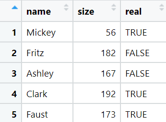

  
```{r setup, include=FALSE}
library(learnr)
# disable warnings
knitr::opts_chunk$set(warning = FALSE, message = FALSE) 
# Link to static resources in Shiny's web server
shiny::addResourcePath("css",
                       system.file("resources","css",
                       package = "deztutr"))
```

```{css echo=FALSE}
```

## Table data everywhere

Before we start to have a closer look how to do data processing with R, we first have to understand how data is (typically) formatted and how we can represent our data for subsequent processing.

In most cases, and thus all over this course, data comes in **table format**. 
An example of a tabular data set is given below.

{width=20%}

In R, you can store such data sets in containers called
- `data.frame` (the basic representation)
- `tibble` (the tidyverse extension)
- `data.table` (another variant for laaaarge data sets)
which will be discussed in detail within the course.

It is important to know that R and the above mentioned data structures require data to be organized such that

- **each row** represents a **single observation**, i.e. **one "data unit"** (here a description of a single character) and
- **each column** describes a single feature/characteristic/attribute/measurement/**variable** of each observation.

Thus, it follows:

- all columns have the **same length** (one entry per observation = row)
- all columns represent the same **type** of data (e.g. the "size" column from above contains only numbers)
- **different columns** can represent **different type** of data (e.g. "name" vs. "size")

Before we can start with any data processing, we therefore have to ensure that the data is formatted correctly.

```{r q-excel-sheet-vs-matrix, echo=FALSE}
question("What representation is closest to a well formatted tabular data set described above?",
  answer("a mathematical matrix", message="Since made of numbers only, better use a dedicated data structure suited for mathematical operations."),
  answer("an MS Excel sheet", correct =T ),
  answer("an MS Word document", message="This covers more than the data table."),
  answer("an HTML webpage table", message="While possible, an html table poses not all constraints from above.")
)
```


```{r q-data-formats, echo=FALSE}
question("What file formats do you know that you think suited to store such data?",
  answer("CSV = comma-separated values", correct = T, message="CSV: Well suited and compact format. Separator can also be a semicolon etc."),
  answer("XLSX = XML-based Excel sheet", correct =T, message="XLSX: Typically good for final data to show your supervisor but not as an intermediate data storage."),
  answer("DOC = an MS Word document", message = "DOC: This is made for formatted text."),
  answer("HTML = an HTML webpage", message = "HTML: Better suited for any kind of information but not best for tabular data."),
  answer("TSV = tab-separated values", correct = T, message="TSV: Same as CSV."),
  answer("PDF = portable document format", message="PDF: This is for final presentation/printing, not data storage."),
  answer("TXT = plain text file", message="TXT: Without formatting rules it will be hard to read the data again.")
)
```


## Data processing workflow


A typical data processing workflow, which we will learn within this course, is therefore composed of the following steps:

1. loading data (e.g from file or creating it via some computation)
2. reformatting data (into a correct format, see above)
3. processing the data (using magic verbs like `filter`, `mutate`, `arrange`, ...)
4. storing data to file (or visualize it as an image).

This is exemplified in the following.
You don't have to understand the details right now, just see the general structure and major workflow steps.

```{r}
# load needed packages
library(tidyverse)

# (1) create data table
rawData <- data.frame(
            name = c("Mickey", "Fritz", "Ashley", "Clark", "Faust"),
            size = c( 56, 182, 167, 192, 173),
            real = c( F, T, T, F, F )
          )
# let's print it for inspection
print(rawData)

# (2) no reformatting needed, "rawData" already in correct table format

# (3) add another "character" colum based on "real" column
# and store in a new variable
myData <- mutate( rawData, character = ifelse(real, "real", "fictional") )

# (4) plot the final data
# create a blank canvas and tell ggplot what column to use where
ggplot( myData, aes(x = name, y = size, col = character ) ) + # '+' adds the next plot element
  
  # define what type of plot to draw using the data
  geom_point( size=4 ) # with additional plotting settings

```

Within the course, we will learn how to plan and do each of the four steps from above for different data sets and problems.


```{r q-ready-to-continue, echo=FALSE}
question("Are you ready to continue?",
  answer("Huuhh... looks all so weird!", message="Don't panic! All will be good! ;)"),
  answer("Yeah, let's rock!", correct =T)
)
```


## Wrap up

But before we continue, think about the following questions, which can be answered with the current material.

- What is represented by a row in a well formatted data table? How is it called?
- What are constraints on a well formatted table column concerning data types and length? How is it called?


