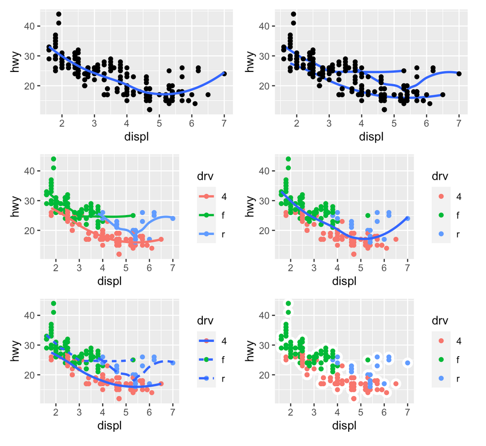

  
```{r setup, include=FALSE}
library(learnr)
library(tidyverse)
# disable warnings
knitr::opts_chunk$set(warning = FALSE, message = FALSE) 
# Link to static resources in Shiny's web server
shiny::addResourcePath("css",
                       system.file("resources","css",
                       package = "deztutr"))
```


## Some data first

Within this tutorial, we want to do some first data visualization using the `ggplot2` package.
But before we can visualize, we need some data and need to know its structure and content.

To this end, we will have a look at the `mpg` data set that is directly available in R once the `ggplot2` package is installed and loaded.

### Help pages in R

When you want to use something new in R, i.e. a data set, a function, whatever, it is a good idea to start looking into its documentation!
RStudio comes with a dedicated view pane "Help" for that, within you can search or browse information.
The following video (*Get Help in R - Get Help Strategically | R-Tutorials.com* [18 min]) gives you a first introduction how to use it and how to get help in and for R.

![Get Help in R - Get Help Strategically | R-Tutorials.com [18 min]](https://youtu.be/vySGuusQI3Y){width="50%"}

Given the video, search for an open the vignette "Aesthetic specifications" from the `ggplot2` package within RStudio.
To this end:

- Open the "Packages" view
- Select the "ggplot2" package
- Follow the link to the vignettes
- Open and (briefly) browse the "Aesthetic specifications" vignette


### The `mpg` data set

As introduced in the video, help content can also be opened from the command line, either by

- using `help(WHATEVER)` or
- using the shortcut `?WHATEVER`, i.e. the `?`-prefix.

Let's try! Open within the following interactive R terminal the help page for `ggplot2::mpg`, i.e. the `mpg` data set that is part of the `ggplot2` package.

```{r help-mpg, exercise=TRUE}
# Write the command to open the help page for the ggplot2::mpg data set
# and hit the "Run Code" button in the upper right.

# NOTE: the help page will open WITHIN RSTUDIO "Help" View !!!
# !!! No output is shown here on the interactive console page !!!
# (sorry for that...)

```

```{r help-mpg-solution}
# NOTE: the following commands are opening the help 
# WITHIN THE "Help" VIEW OF RSTUDIO !!!
# !!! no output on the interactive console !!!

# using the shortcut and specifying both package (ggplot2) and data set (mpg)
# the double-colon notation says "mpg belongs to the ggplot2 package"
?ggplot2::mpg

# or doing it explicitly with the help function
help(topic="mpg", package=ggplot2)

# if you loaded the ggplot library already, you can directly ask for the data set
library(ggplot2)
?mpg       # using the shortcut
help(mpg)  # using the help function explicitly
```

When all went fine, this should open the respective help page within the RStudio "Help" View tab.
Alternatively, you can have a look at the online version [here](https://www.rdocumentation.org/packages/ggplot2/versions/3.3.5/topics/mpg)

Have a closer look and answer the following question.

```{r mpg-help-, echo=FALSE}
question("How many observations does the `mpg` data set cover?",
  answer("11", message="No, that's the number of variables, i.e. columns."),
  answer("42", message="No, this is the 'ultimate answer' it doesn't fit here."),
  answer("234", correct=T)
)
```


### Glimpse the data

To have a first look at the data, we can use the `head()` function, which provides us with the first rows of a the table.
So the output of `head(mpg)` looks like this:


```{r mpg-head-out, echo=FALSE}
library(ggplot2)
head(mpg)
```

But why is the code below not working? 
Try to correct it!


```{r prepare-mpg-head, echo=F}
detach("package:ggplot2", unload = T)
```

```{r mpg-head, exercise=TRUE}
head(mpg)
```


```{r mpg-head-hint-1}
# You need to remember the discussion of "classic problems" when using packages from one of the previous tutorials.
```

```{r mpg-head-hint-2}
# Is the `mpg` data set is part of the `ggplot2` library... Did you tell R about it?
```

```{r mpg-head-solution}
# The mpg data set is part of the ggplot2 library.
# Thus, we first have to LOAD THE LIBRARY before we can use the data!

library(ggplot2)

# Afterwards, the initial command is working!
head(mpg)

```


Another way to inspect (tabular) data is via the `glimpse()` function, which is part of the `dplyr` package for data manipulation. In contrast to `head()` is provides a 'variable-centered' view of the data, i.e. one output row per variable column, as shown below:

```{r glimpse-mpg}
library(dplyr)
library(ggplot2)
glimpse(mpg)
```

This shows 

- the dimensions of the table (rows and columns)
- for each variable column
  - name
  - data type
  - the first elements up to a limited output line width


From [Introduction to Data Science (Chapter 4)](https://rafalab.github.io/dsbook/tidyverse.html#exercises-8) we borrowed the following exercises.
You can solve them using the already introduced functions `help()` (or `?`), `print()` and `glimpse()`.

Examine the built-in dataset `co2`. 

```{r irizzary-e, exercise=TRUE}

```

```{r irizzary-e-question, echo=FALSE}
question("Which of the following is true?",
  answer("`co2` is tidy data: it has one year for each row."),
  answer("`co2 is not tidy: we need at least one column with a character vector."),
  answer("`co2 is not tidy: it is a matrix instead of a data frame."),
  answer("`co2 is not tidy: to be tidy we would have to wrangle it to have three columns (year, month and value), then each co2 observation would have a row.", correct=TRUE)
)
```

Examine the built-in dataset `ChickWeight`.

```{r irizzary-ee, exercise=TRUE}

```

```{r irizzary-ee-question, echo=FALSE}
question(" Which of the following is true?",
      answer("`ChickWeight is not tidy: each chick has more than one row."),
      answer("`ChickWeight is not tidy: we are missing the year column."),
      answer("`ChickWeight is tidy: it is stored in a data frame."),
      answer("`ChickWeight is tidy: each observation (a weight) is represented by one row. The chick from which this measurement came is one of the variables.", correct=TRUE)
)
```

Examine the built-in dataset `BOD`. 

```{r irizzary-eee, exercise=TRUE}

```

```{r irizzary-eee-question, echo=FALSE}
question(" Which of the following is true?",
    answer("`BOD is not tidy: it only has six rows."),
    answer("`BOD is not tidy: the first column is just an index."),
    answer("`BOD is tidy: each row is an observation with two values (time and demand)", correct=TRUE),
    answer("`BOD is tidy: all small datasets are tidy by definition.")
)
```


## Let's visualize!

In the following, you will study the first parts of the [Data visualisation](https://r4ds.had.co.nz/data-visualisation.html) chapter of the [R for Data Science](https://r4ds.had.co.nz/index.html) online tutorial of the book by Hadley Wickham and Garret Grolemund.

Since the online book tutorial is not interactive, you are encouraged to use the following interactive R consoles to

- repeat and follow the code examples of the tutorial
- solve the exercises of the tutorial (which we recreated below)

So let's start! 

In the following, we link (via the following section captions) the specific chapters and provide respective interactive consoles and additional information for each.

### [Study 3.1 Introduction @ R4DS](https://r4ds.had.co.nz/data-visualisation.html#introduction-1)

**NOTE:** Within the rest of this tutorial, the **packages** from the `tidyverse`, i.e. `ggplot2`, `dplyr`, etc., are **already preloaded**, such that you can **directly use their functions and data** within the following consoles.

### [Study 3.2 First steps @ R4DS](https://r4ds.had.co.nz/data-visualisation.html#first-steps)


```{r hadley-first-steps, exercise=TRUE}
ggplot(data = mpg) + 
  geom_point(mapping = aes(x = displ, y = hwy))
```


Run ggplot(data = mpg). What do you see?

```{r hadley-first-steps-e, exercise=TRUE}
ggplot(data = mpg)
```

```{r hadley-first-steps-e-solution}
# prints only an empty canvas since we did not specify what geometry we are interested in!
```

Make a scatterplot of `hwy` vs `cyl`.

```{r hadley-first-steps-ee, exercise=TRUE}

```

```{r hadley-first-steps-ee-solution}
ggplot(data = mpg) + 
  geom_point(mapping = aes(x = hwy, y = cyl))
```

What happens if you make a scatterplot of `class` vs `drv`? Why is the plot not useful?

```{r hadley-first-steps-eee, exercise=TRUE}

```

```{r hadley-first-steps-eee-solution}
ggplot(data = mpg) + 
  geom_point(mapping = aes(x = class, y = drv))

# Since "drv" is a categoric variable, multiple points are drawn on top of each other.
# Thus, the number of data points per spot etc. cannot be inferred from this plot,
# which renders it useless.
```


### [Study 3.3 Aesthetic mappings @ R4DS](https://r4ds.had.co.nz/data-visualisation.html#aesthetic-mappings)

Coloring by `class`.

```{r hadley-aes-map, exercise=TRUE}
ggplot(data = mpg) + 
  geom_point(mapping = aes(x = displ, y = hwy, color = class))

# - alter the code from above to connect the point size aesthetic to 'class'
# - same for shape or alpha-level of points
# - set a color for all points (not dependent on any variable)
```

```{r hadley-aes-map-solution}
ggplot(data = mpg) + 
  geom_point(mapping = aes(x = displ, y = hwy, class = class))
```


What’s gone wrong with this code? Why are the points not blue?

```{r hadley-aes-map-e, exercise=TRUE}
ggplot(data = mpg) + 
  geom_point(mapping = aes(x = displ, y = hwy, color = "blue"))
```

```{r hadley-aes-map-e-solution}
ggplot(data = mpg) + 
  geom_point(mapping = aes(x = displ, y = hwy), color = "blue")

# The general color specification has to be done OUTSIDE of the 'mapping' via the 'aes()' function.
# Both are used to map variables (columns) of the input data (here the 'mpg' table) onto aesthetics.
# Since we want to color independently of variables (all points the same), the color specification 
# has to be done separately.
```


Which variables in `mpg` are categorical? Which variables are continuous? (Hint: check the data types of the variables via `glimpse(mpg)`.)


```{r hadley-aes-map-ee, exercise=TRUE}
glimpse(mpg)
```

```{r hadley-aes-map-ee-solution}
# all variables of type <chr>, i.e. 'character' = text variables, are categorical.
# <int> (integer) and <dbl> (double floating point) are numeric and thus continuous.
```

Map a continuous variable to `color`, `size`, and `shape`. How do these aesthetics behave differently for categorical vs. continuous variables?


```{r hadley-aes-map-eee, exercise=TRUE}
# extend the following call
ggplot(data = mpg) + 
  geom_point(mapping = aes(x = displ, y = hwy ))
```

```{r hadley-aes-map-eee-solution}
# trying this with categorical variables
ggplot(data = mpg) + 
  geom_point(mapping = aes(x = displ, y = hwy, col = model, shape= manufacturer, size= trans))
# shows that 
# - distinct colors are used for each category (color palette defines how well they can be distinguished)
# - only up to 6 shapes are supported (only first 6 categories get a data point symbol)
# - size uses lexicographical order of the categories to define the point sizes

# trying this with continuous (numeric) variables
ggplot(data = mpg) + 
  geom_point(mapping = aes(x = displ, y = hwy, col = year, size= cty))
# shows that
# - color uses a continuous color scale (default using blue to black)
# - shape can ONLY be used with categorical variables (so remove to see result)
# - size scales point sizes linearly in the value range of the variable (from min to max value)
```


What happens if you map the same variable to multiple aesthetics?


```{r hadley-aes-map-eeee, exercise=TRUE}
ggplot(data = mpg) + 
  geom_point(mapping = aes(x = displ, y = displ, col = displ, size=displ))
```

```{r hadley-aes-map-eeee-solution}
# works without problems
# - result depends on whether it is a categorical or continuous variable
```


What happens if you map an aesthetic to something other than a variable name, like `aes(colour = displ < 5)`?

```{r hadley-aes-map-eeeee, exercise=TRUE}
ggplot(data = mpg) + 
  geom_point(mapping = aes(x = displ, y = hwy, colour = displ < 5))
```

```{r hadley-aes-map-eeeee-solution}
# the expression/formula/function (here "displ < 5") gets evaluated
# here the result will be a boolean information for each point whether it is below 5 (TRUE) or not (FALSE)
# the information is subsequently used as values for the specified aesthetic (see legend in the image)
```


### [Study 3.4 Common problems @ R4DS](https://r4ds.had.co.nz/data-visualisation.html#common-problems)

Get the following code working, i.e. drawing a scatterplot.

```{r hadley-com-prob, exercise=TRUE}
ggplot(data = mpg) 
+ geom_point(mapping = aes(x = displ, y = hwy))
```

```{r hadley-com-prob-solution}
ggplot(data = mpg) + 
  geom_point(mapping = aes(x = displ, y = hwy))

# (at least) the "+" symbol has to be in the same line as the closing bracket of the "ggplot()" part

```

**WHY?** R continues to combine **lines into one "block of work"** until it assumes the block at an end.
Empty lines inbetween are ignored.

R keeps **adding lines while** at the end of a line it finds

- **arithmetic or processing symbols** like `+`, `-`, `==`, `%>%`, ...
```{r r-readalong-arithmetic, eval=FALSE}
3 +
  4
```

- **missing closing brackets**
```{r r-readalong-bracket, eval=FALSE}
help( 
  mpg
      )
```

- **assignment symbols** "<-" (or "=" for parameters within "()" brackets)

```{r r-readalong-assignment, eval=FALSE}
myVariable <-
  4
```


That way, you can spread complex function call over multiple lines to enhance readability.

```{r r-multiline, eval=FALSE}
ggplot(data = mpg) + 
  geom_point(mapping = aes(
    x = displ, 
    y = hwy, 
    color = class
  ))
```


### [Study 3.6 Geometric objects @ R4DS](https://r4ds.had.co.nz/data-visualisation.html#geometric-objects)

```{r hadley-geom-first-vis}
# left
ggplot(data = mpg) + 
  geom_point(mapping = aes(x = displ, y = hwy))

# right
ggplot(data = mpg) + 
  geom_smooth(mapping = aes(x = displ, y = hwy))
```

Within the following console you can start playing and repeating the examples via Copy-and-Paste or your own ideas.

```{r hadley-geom-add-color, exercise=TRUE}
ggplot(data = mpg) + 
  geom_smooth(mapping = aes(x = displ, y = hwy, linetype = drv))
```

Given the following code:
```{r shared-mapping-code, eval=F}
ggplot(data = mpg, mapping = aes(x = displ, y = hwy)) + 
  geom_point(mapping = aes(color = class)) + 
  geom_smooth()
```

```{r q-shared-mapping, echo=FALSE}
question("Why don't we have to provide an aesthetics mapping for `geom_smooth()` in the code from above?",
  answer("No idea...", message="Mhh.. better recheck the tutorial, it's all in there! ;)"),
  answer("The mapping within 'ggplot()' is shared among all geometries", correct =T, message="Note, this means that the mapping can be extended or even overwritten within individual geometries (as it is done within 'geom_point()' within the example)."),
  answer("The mapping is taken/inherited from the geometry preceeding it and so on", message="No, this would accumulate aesthetics, which might cause conflicts, and some aesthetics are only applicable to specific geometries. Please reread the material!")
)
```


What geom (just find the function name) would you use to draw... 

```{r hadley-geom-geom-name, exercise=TRUE}
# ... a line chart? 
# ... a boxplot? 
# ... a histogram? 
# ... an area chart?
```


```{r hadley-geom-geom-name-hint}
# check out the ggplot2 cheatsheet at https://raw.githubusercontent.com/rstudio/cheatsheets/main/data-visualization.pdf
```

```{r hadley-geom-geom-name-solution}
# eventually quite obvious:
# ... a line chart  = geom_line()
# ... a boxplot     = geom_boxplot()
# ... a histogram   = geom_histogram()
# ... an area chart = geom_area()

# the ggplot2 cheat sheet lists respective aesthetics for each geometry
# https://raw.githubusercontent.com/rstudio/cheatsheets/main/data-visualization.pdf
```


Run this code in your head and predict what the output will look like. Then, run the code in R and check your predictions.

```{r hadley-geom-e, exercise=TRUE}
ggplot(data = mpg, mapping = aes(x = displ, y = hwy, color = drv)) + 
  geom_point() + 
  geom_smooth(se = FALSE)
```

What does `show.legend = FALSE` do? What happens if you remove it?
Why do you think it was used earlier in the chapter?

```{r hadley-geom-ee, exercise=TRUE}
ggplot(data = mpg) +
  geom_smooth(
    mapping = aes(x = displ, y = hwy, color = drv),
    show.legend = FALSE
  )
```

```{r hadley-geom-ee-solution}
# "show.legend = FALSE" suppresses legend generation but keeps the respective aesthetic mapping.
# Thus, it was possible to create the same grouping as when using "group" but still using the data mapping for the aesthetics.
```


```{r q-hadley-geom-se, echo=FALSE}
question("What does the `se` argument to `geom_smooth()` do?",
  answer("Switches to the 'simple edition' of the geometry"),
  answer("Defines if the 'statistical error' is displayed", correct =T, message="Yes, confidence intervals mark the estimated statistical error of the trend (line) with respect to the data. The wider the worse is the fit, i.e. fewer points are close to the line."),
  answer("Activates the 'search engine' to speed up computation")
)
```

Will these two graphs look different? Why/why not?

```{r hadley-geom-eee, exercise=TRUE}
ggplot(data = mpg, mapping = aes(x = displ, y = hwy)) + 
  geom_point() + 
  geom_smooth()

ggplot() + 
  geom_point(data = mpg, mapping = aes(x = displ, y = hwy)) + 
  geom_smooth(data = mpg, mapping = aes(x = displ, y = hwy))
```

```{r hadley-geom-eee-solution}
# There is no difference in the outcome, since
# the first version shares the aesthetics mapping among the geometries, while
# the second version uses explicit individual mappings that are the same for both.
```


Recreate the R code(s) necessary to generate the following graphs, while ignoring 

- point size
- line width

since they are not in relation to the plot area's dimensions (which is larger here compared to the images).

{width=60%}

```{r hadley-geom-eeee, exercise=TRUE}

```

```{r hadley-geom-eeee-solution}
# top left
ggplot(data = mpg, mapping = aes(x = displ, y = hwy)) + 
  geom_point() + 
  geom_smooth( se=FALSE )

# top right
# Note: points are ON TOP of the lines! Thus, have to be drawn later...
ggplot(data = mpg, mapping = aes(x = displ, y = hwy)) + 
  geom_smooth( mapping=aes(group=drv), se=FALSE) +
  geom_point()

# middle left
ggplot(data = mpg, mapping = aes(x = displ, y = hwy, col=drv)) + 
  geom_point() +
  geom_smooth( se=FALSE )

# middle right
ggplot(data = mpg, mapping = aes(x = displ, y = hwy)) + 
  geom_point( mapping= aes(col=drv)) +
  geom_smooth( se=FALSE )

# bottom left
ggplot(data = mpg, mapping = aes(x = displ, y = hwy)) + 
  geom_point( mapping= aes(col=drv) ) +
  geom_smooth( mapping = aes(lty=drv), se=FALSE)

# bottom right
ggplot(data = mpg, mapping = aes(x = displ, y = hwy)) + 
  geom_point( size=5, col="white") +
  geom_point( mapping = aes(col=drv) )

# or using a different (filled) point symbol (=shape) with an enlarged border (=stroke)
ggplot(data = mpg, mapping = aes(x = displ, y = hwy, fill=drv)) + 
  geom_point( size=5, col="white", shape = 21, stroke=3 )

# For the last alternative, we had to check out the "Aesthetics vignette" of the ggplot2 package
# https://ggplot2.tidyverse.org/articles/ggplot2-specs.html
# Do you remember seeing it before? ;)

```


## Wrap-up

But before we continue, think about the following questions, which can be answered with the current material.

- How do you get help for a function within R?
- What function(s) can you use to have a first look at (large) data tables?
- Can we distribute a single command over multiple consecutive lines? What do we have to have in mind?
- What is the central difference when using categorical vs continuous variables for aesthetics like `color`?
- What do we get when we call `ggplot()` without any geometry function and why?
- How do we share aesthetic mappings among multiple geometries of the same plot?
- Is the order of the geometries important for plotting?


```{r child = 'images/cheatsheet.Rmd'}
```

